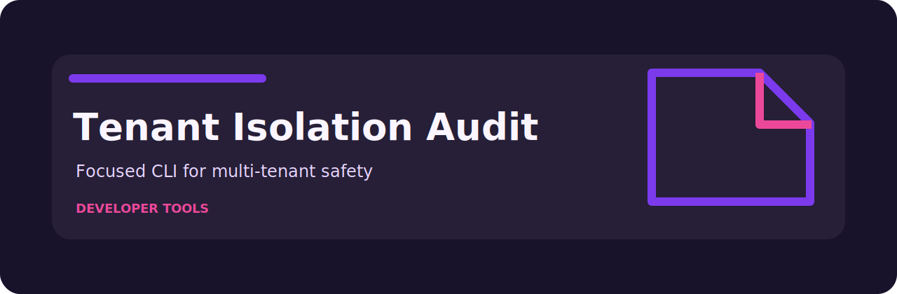

# Tenant Isolation Audit



Review multi-tenant design notes for isolation and access-control gaps.

## The rule file is the product

- `missing-tenant-filter` (high): tenant filter is missing. Fix: Require tenant predicate on all scoped data access..
- `shared-resource` (medium): shared resource detected. Fix: Document isolation controls and access policies..
- `missing-access-test` (low): cross-tenant access test is missing. Fix: Add tests for denied cross-tenant access..

Everything else in the repo exists to feed records into those checks and render the answer in a way a person can act on.

## Shell session

```bash
git clone https://github.com/mertefekurt/tenant-isolation-audit.git
cd tenant-isolation-audit
python -m venv .venv
source .venv/bin/activate
python -m pip install -e ".[dev]"
tenant-isolation-audit examples/sample.txt
tenant-isolation-audit examples/sample.txt --json
```

## Repository shape

```text
.github/        CI workflow
examples/       sample inputs
src/            package source
tests/          test coverage
.gitignore      project file
pyproject.toml  package metadata
```
