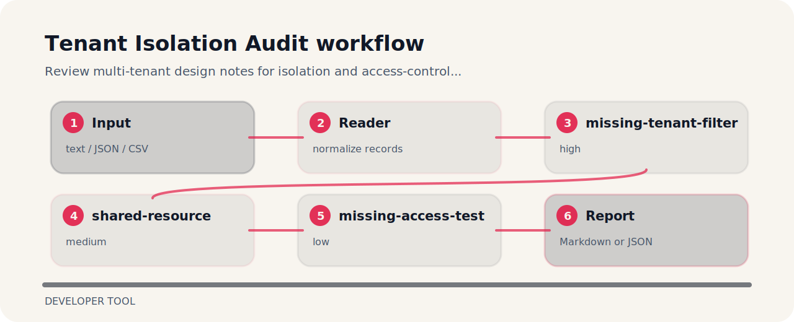

# Tenant Isolation Audit

| Detail | Value |
| --- | --- |
| Area | developer tool |
| Entry | `tenant-isolation-audit` |
| Input | plain text |
| Output | terminal findings, optional JSON |


## What it protects

Review multi-tenant design notes for isolation and access-control gaps. The command is intentionally direct so it can sit in a local review, a CI step, or a one-off audit.

## Signal route



## Review notes

- `missing-tenant-filter` - tenant filter is missing (high); Require tenant predicate on all scoped data access..
- `shared-resource` - shared resource detected (medium); Document isolation controls and access policies..
- `missing-access-test` - cross-tenant access test is missing (low); Add tests for denied cross-tenant access..

## Local check

```bash
git clone https://github.com/mertefekurt/tenant-isolation-audit.git
cd tenant-isolation-audit
python -m pip install -e ".[dev]"
tenant-isolation-audit examples/sample.txt
```
